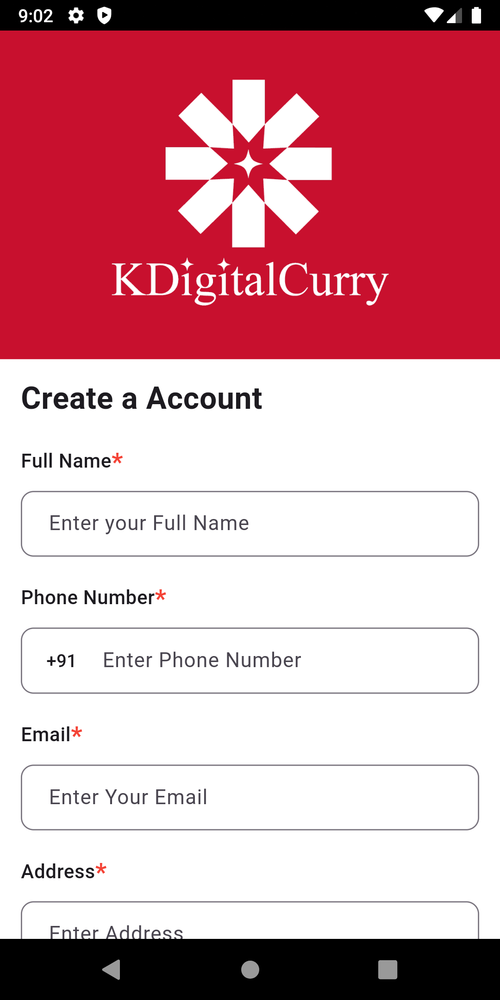
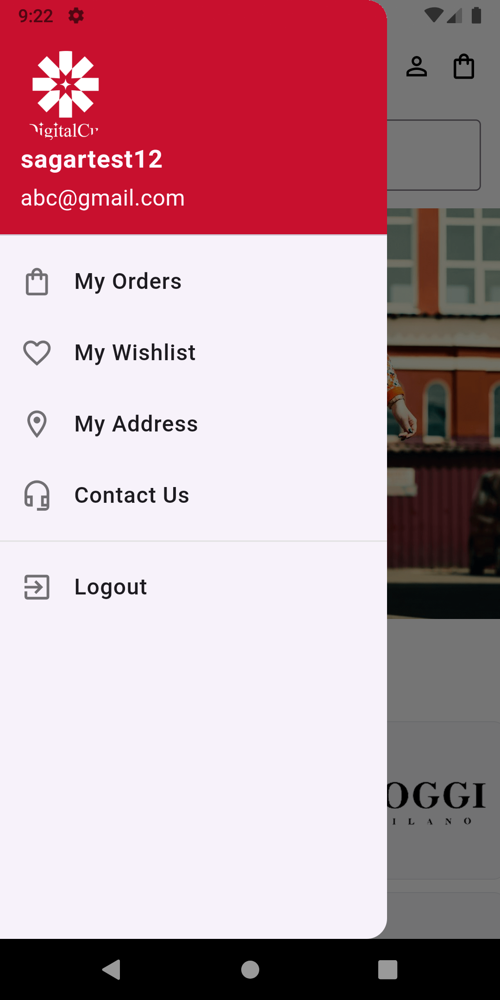
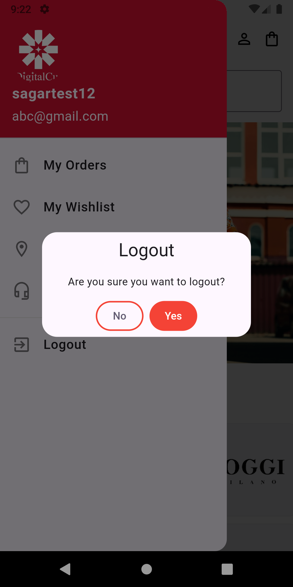
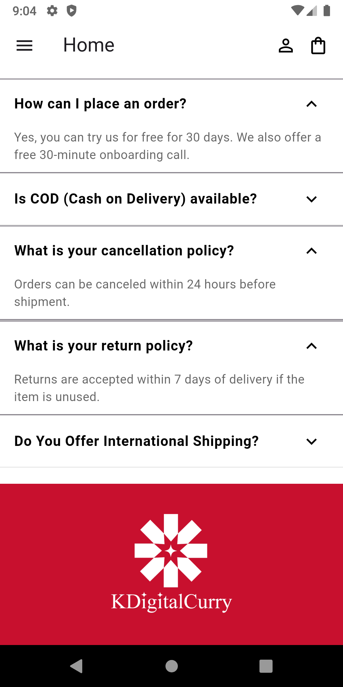
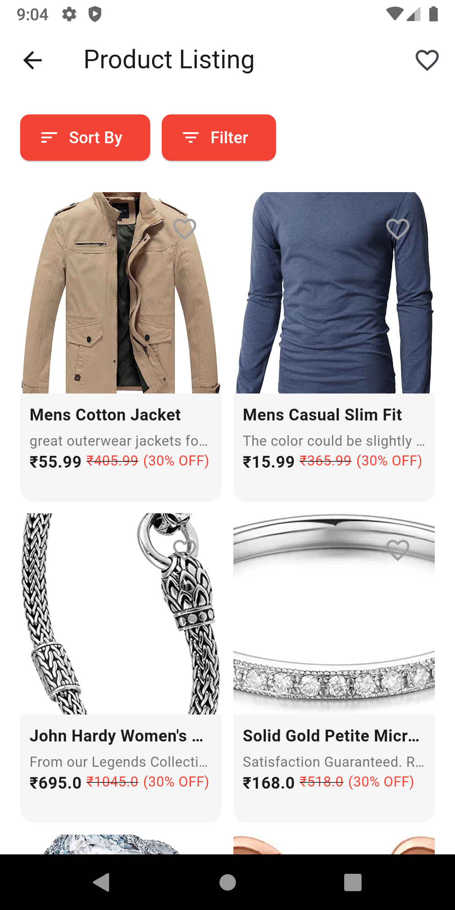
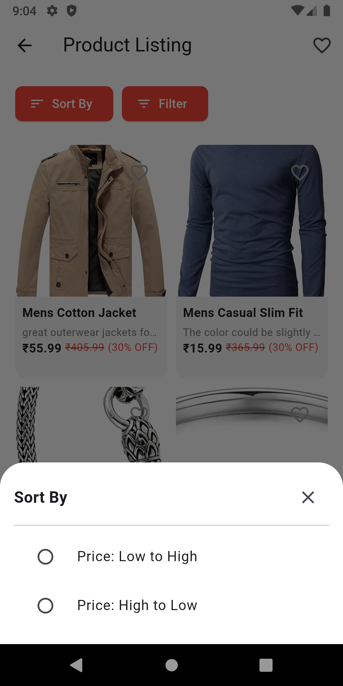
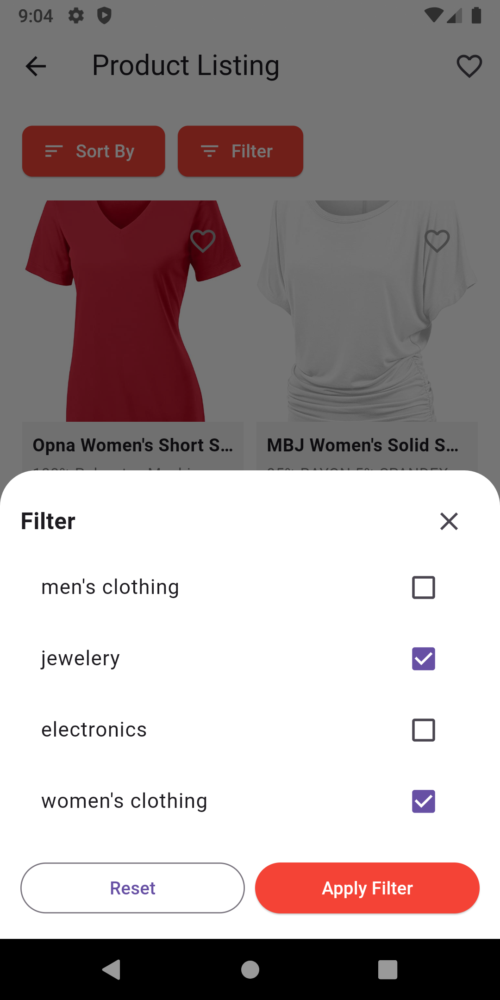
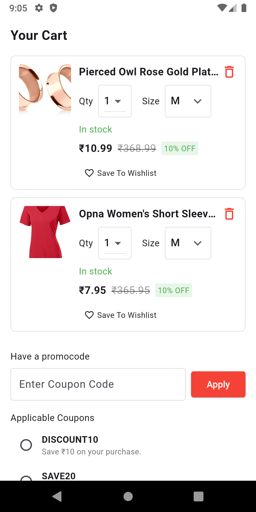
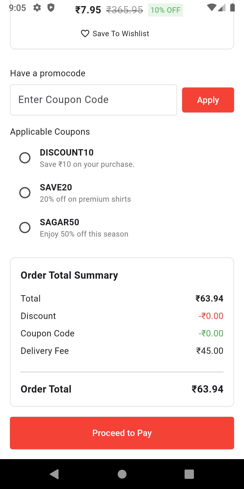

# KDigital Curry Ecom

**KDigital Curry Ecom** is a feature-rich e-commerce application built using **Flutter**. It allows users to easily browse products, apply discount coupons, and make purchases with a smooth and interactive user experience.

## Features

- **User Authentication**: Register, login, and logout functionalities.
- **Product Filtering**: Filter products by price and category to help users find exactly what they need.
- **Shopping Cart**: Add multiple products to the cart and manage them seamlessly.
- **Coupon Code**: Apply coupon codes to products for discounts, ensuring the best deals for users.
- **Lottie Animations**: Enjoy engaging animations during loading and payment completion.
- **API Integration**: Fast and reliable communication with the Dio API.

## Tech Stack

- **Flutter**: Cross-platform app development framework.
- **Dio**: Powerful HTTP client for API calls.
- **Lottie**: Animation framework for rich visual effects.

## Apps Screenshots

<table>
  <tr>
     <td>Splash Screen</td>
     <td>Login Screen</td>
     <td>Register Screen</td>
     <td>Navigation Drawer</td>
     <td>Logout Screen</td>
  </tr>
  <tr>
    <td></td>
    <td></td>
    <td></td>
    <td></td>
    <td></td>
  </tr>
 </table>

<table>
  <tr>
     <td>home 1</td>
     <td>home 2</td>
     <td>home 3</td>
     <td>home 4</td>
     <td>home 5</td>
  </tr>
  <tr>
    <td></td>
    <td></td>
    <td></td>
    <td></td>
    <td></td>
  </tr>
 </table>

<table>
  <tr>
     <td>home 6</td>
     <td>Product Listing</td>
     <td>Product Filtering 1</td>
     <td>Product Filtering 2</td>
     <td>Product WhishList</td>
  </tr>
  <tr>
    <td></td>
    <td></td>
    <td></td>
    <td></td>
    <td></td>
  </tr>
 </table>

 <table>
  <tr>
     <td>Add To Cart</td>
     <td>Add To Cart 2</td>
     <td>Payment Done</td>
  </tr>
  <tr>
    <td></td>
    <td></td>
    <td></td>
  </tr>
 </table>
 
## Installation

### Prerequisites

Before you begin, ensure you have the following installed on your system:

- **Flutter**: [Flutter Installation Guide](https://flutter.dev/docs/get-started/install)
- **Dart**: Dart comes bundled with Flutter, so no separate installation is required.
- **Android Studio** or **VS Code** (with Flutter and Dart plugins installed).

### Clone the repository

```bash
git clone https://github.com/sagardhadke/KDigitalCurry-Store.git
cd KDigital-Curry-Ecom
